# Intro
We are submitting a solution for a hackathon 

# The challenge
Build a Databricks App that turns messy healthcare facility data into decisions a non-technical planner can trust. Read the full prompt, dataset overview, and the four tracks below.

# Prompt
You are given 10,000 messy records of healthcare facilities across India. Each record includes structured fields such as location and specialties, plus uneven free-text descriptions of claimed capabilities, procedures, equipment, and services.

Build a Databricks App that helps a non-technical healthcare planner, NGO coordinator, or analyst turn this messy data into decisions they can trust.

Your app should extract useful structure from the records, show evidence for its conclusions, communicate uncertainty honestly, and let users save or revise their work.

# Core Requirements
Your submission must:

- Run as a Databricks App on Free Edition.
- Use the provided facility dataset.
- Support a clear non-technical user workflow.
- Cite the underlying facility text for any important claim, recommendation, score, or ranking.
- Communicate uncertainty instead of presenting weak evidence as fact.
- Persist user actions such as notes, overrides, shortlists, scenarios, or review decisions.

# Dataset
The provided dataset contains 10,000 Indian healthcare facility records and 51 columns.

All records include facility name, state, city, latitude, longitude, controlled specialties, a description, and source URLs; 9,996 records include a postcode. The extracted evidence fields are noisy, repetitive, and unevenly supported:

| Field |	Coverage |
|--|--| 
|description|	100%|
|capability|	99.7%|
|procedure|	92.5%|
|equipment|	77.0%|
|numberDoctors|	36.4%|
|capacity|	25.2%|
|yearEstablished|	47.8%|


Useful evidence appears across description, capability, procedure, equipment, specialties, and source_urls. Teams should treat these fields as claims to verify rather than ground truth.

There is sample data for the saw data in sample_data/raw_data/*.csv


# What we are creating:

##  Referral Copilot
Question: Where should a patient or coordinator actually go?

Build an app where a user enters a location and a care need, such as "dialysis near Jaipur" or "emergency surgery near Patna," and receives an evidence-attached shortlist of candidate facilities.

Minimum workflow: location and need in; ranked candidates out; each candidate shows distance, matching evidence, missing or suspicious evidence, and can be saved to a shortlist.

The end goal is a Databricks frontend app served over a lakebase database

# Source data
The raw source data we have available is present as a calatog in the databricks workspace under the tables

databricks_virtue_foundation_dataset_dais_2026.virtue_foundation_dataset.facilities
databricks_virtue_foundation_dataset_dais_2026.virtue_foundation_dataset.india_post_pincode_directory
databricks_virtue_foundation_dataset_dais_2026.virtue_foundation_dataset.nfhs_5_district_health_indicators


# CareMap — Project Context

## 1. Overview

CareMap is a referral-matching tool (Track 3) that addresses a core gap in care
navigation: when a patient or coordinator needs a service like *"dialysis near
Jaipur"* or *"emergency surgery near Patna,"* existing facility directories are
stale, unverifiable, and ignore real travel distance — leaving risky gaps
(expired licenses, false capability claims) invisible until it's too late.

**Minimum workflow:** a location + a care need go in; a ranked shortlist of
candidate facilities comes out. Each candidate displays:

- Distance from the entered location
- Supporting (matching) evidence
- Missing or suspicious evidence
- A one-click "save to shortlist" action

## 2. System Architecture

```
CareMap app  →  CareMap engine  →  Evidence sources / Shortlist
```

- **CareMap app**: search, results, evidence detail, shortlist
- **CareMap engine**: parses the query, geo-searches candidates, runs the
  evidence-matching model, computes a transparent ranking score
- **Data sources**: facility registries, accreditation records, travel-time
  APIs

## 3. Scoring Model

| Component | Weight |
|---|---|
| Capability match | 45% |
| Travel proximity | 30% |
| Evidence freshness | 15% |
| Risk penalty | variable — can outweigh an otherwise strong score |

A worked example reaches a 92% match score for a sample hospital. Scoring
should be transparent and auditable — every component traceable back to its
source record.

## 4. Open Risks / Roadmap

**Open risks:** data coverage gaps, evidence staleness, score
interpretability, and the liability of flagging a facility as "suspicious."

**Roadmap (MVP → V2):**

1. **MVP** — single region, single care need, manual/curated data
2. **V1** — automated ingestion, broader region/need coverage
3. **V2** — feedback loops, partner API access, NFHS-driven demand modeling

---

## 5. Virtue Foundation Dataset

Catalog: `databricks_virtue_foundation_dataset_dais_2026`. Three tables:

### 5.1 Facilities Table (10,088 records)

Healthcare facilities across India.

- **Facility details**: names, types (hospitals, clinics, dentists),
  organization info
- **Contact info**: phone, email, website, social media links
- **Location data**: full addresses (city, state, postal code,
  latitude/longitude)
- **Operational details**: year established, doctor count, capacity,
  specialties, equipment, procedures
- **Digital presence**: social media activity, follower counts, engagement,
  page-update recency
- **Clustering**: `cluster_id` for geographic/categorical grouping

Sourced via "kie" (Knowledge Information Extraction).

### 5.2 NFHS-5 District Health Indicators (706 records)

District-level health survey data:

- Demographics (population, sex ratios, household surveys)
- Infrastructure (electricity, water, sanitation, cooking fuel, health
  insurance)
- Maternal health (antenatal care, institutional births, C-sections,
  postnatal care)
- Child health (vaccination, stunting/wasting/underweight, breastfeeding)
- Disease prevalence (diarrhea, respiratory infections, anemia)
- Family planning (contraceptive use, unmet needs)
- Non-communicable disease indicators (blood pressure, blood sugar, BMI,
  cancer screening)
- Lifestyle factors (tobacco, alcohol)

### 5.3 India Post Pincode Directory (165,627 records)

Postal code reference table:

- PIN codes, office names/types, delivery status
- Administrative hierarchy: circle, region, division
- District/state names with latitude/longitude

Serves as the geographic reference layer for mapping and location-based
analysis.

### 5.4 Dataset Use Cases

- Healthcare access analysis (facility distribution, underserved areas)
- Public health research (district health outcomes vs. facility availability)
- Geographic analysis (combining pincodes with facilities and indicators)
- Resource planning (infrastructure gaps vs. population health needs)

---

## 6. Relevance to the CareMap MVP

### 6.1 Facilities Table — Core Matching Asset

**Geographic coverage for MVP region selection**

- Maharashtra (1,575 facilities), Gujarat (981), Uttar Pradesh (919) have the
  strongest coverage
- Jaipur: 190 facilities with complete data
- Patna: 138 facilities (135 with complete capability data)
- Both example cities have sufficient density for MVP validation

**Capability matching (45% of score)**

- 99% of facilities (9,973/10,088) have `specialties` as JSON arrays (e.g.,
  `["dialysis", "nephrology", "emergencyMedicine"]`)
- 99% have equipment lists (e.g., `["Dialysis machines: 10", "CT scanner",
  "MRI scanner"]`)
- 99% have capacity and doctor-count fields
- Rich examples: Aravind Eye Hospital (650 beds, 50+ specialties), Fortis
  Gurugram (1,000 beds, 200 doctors)

**Travel proximity (30% of score)**

- 99% of facilities (9,970/10,088) have lat/long coordinates
- Can be combined with the India Post Pincode Directory for distance
  calculations
- Ready for integration with travel-time APIs (Google Maps, Mapbox)

**Evidence freshness (15% of score)**

- 99% have `post_metrics_most_recent_social_media_post_date`
- 99% have `recency_of_page_update`
- 99% have contact info (phone, email, website) for verification
- Example: Fortis Gurugram — `recency_of_page_update: 2025-12-13`,
  `post_metrics_most_recent_social_media_post_date: 2025-11-14`

**Risk penalty indicators (real-world test cases)**

- 118 facilities (1.2%) missing coordinates → can't calculate distance
- 145 facilities (1.4%) have suspicious facility types (corrupted data, JSON
  strings, coordinates in wrong fields)
- 115 facilities (1.1%) lack both capability info AND freshness indicators
- 57 facilities (0.6%) have no contact information at all

### 6.2 NFHS-5 Indicators — Demand Modeling (V2)

- Jaipur: 97.3% institutional births, 81.5% health insurance coverage, 18%
  C-section rate
- Patna: 89.1% institutional births, 10.2% health insurance coverage, 22%
  C-section rate

V2 use cases:

- **Demand forecasting**: high institutional birth rates + low insurance
  coverage (e.g., Patna) suggest higher need for affordable maternity
  facilities
- **Capability prioritization**: districts with high C-section rates need
  facilities with surgical capability
- **Risk stratification**: low health-insurance-coverage areas may need
  facilities that accept government schemes

### 6.3 India Post Pincode Directory — Geographic Reference Layer

- Complete postal code coverage with district/state mapping
- Lat/long for 165k+ locations
- Can geocode user queries (e.g., "dialysis near Jaipur pincode 302001") and
  define catchment areas

### 6.4 MVP Implementation Plan

**Phase 1 — single region + care need**

- Start with Jaipur or Maharashtra (best data density)
- Focus on 2–3 care needs with clear capability markers:
  - **Dialysis** → filter facilities with `"dialysis"` in specialties +
    `"Dialysis machines"` in equipment
  - **Emergency surgery** → filter for `"emergencyMedicine"` +
    `"generalSurgery"` + operating-theatre equipment
  - **Maternity care** → filter for `"gynecologyAndObstetrics"` +
    `"neonatologyPerinatalMedicine"`

**Scoring implementation**

- Capability match (45%): count matching specialties + equipment keywords
- Travel proximity (30%): Haversine distance from user location to facility
  coordinates
- Evidence freshness (15%): days since `recency_of_page_update` or
  `post_metrics_most_recent_social_media_post_date`
- Risk penalty: flag facilities with missing coordinates, no contact info,
  suspicious facility types, or freshness > 365 days

**Evidence display**

- Supporting: matched specialties, equipment, capacity, recent update dates
- Missing: no phone/email, no social media activity, no equipment list
- Suspicious: corrupted facility types, coordinate mismatches, conflicting
  data

### 6.5 Data Gaps to Address

- **No accreditation/license data** — no NABH certification, medical council
  registration, or license expiry dates (the "expired licenses" risk from the
  deck is not directly verifiable from this dataset)
- **No real-time operational status** — social media dates indicate activity
  but not current bed availability or service disruptions
- **Limited specialty granularity** — specialties are JSON arrays that may
  need parsing/normalization for precise matching

### 6.6 V2 Enhancements

- Integrate NFHS indicators to prioritize underserved districts
- Use the pincode directory to expand "near X" queries to surrounding postal
  codes
- Add a feedback loop: track which facilities users shortlist/reject to
  refine scoring weights

### 6.7 Bottom Line

This dataset provides ~99% coverage of the core fields needed for the MVP
scoring model (capability, location, freshness). The 1–2% data-quality issues
are themselves useful — they're real examples for testing "suspicious
evidence" flagging logic. Starting region candidates: Jaipur or Maharashtra,
focused on dialysis + emergency surgery, with 190–1,575 candidate facilities
to rank and display.

---

## 7. Facility Indicator Tag System (Data-Grounded)

A green/yellow/red tag system, fully grounded in the Virtue Foundation
dataset, for surfacing evidence quality on each candidate card.

### 7.1 🟢 Green Indicators (Positive Signals)

**Evidence freshness**

- ✅ Recently Updated — page updated within last 6 months (8,681 facilities /
  86%)
- ✅ Active Social Media — social post within last 6 months (5,654 facilities
  / 56%)
- ✅ Multiple Contact Methods — has phone, email, AND website (10,031
  facilities / 99%)

**Digital presence & verification**

- ✅ Strong Social Presence — active on 2+ social platforms (7,614 facilities
  / 75%)
- ✅ High Engagement — 1,000+ social media followers (2,262 facilities / 22%)
- ✅ Professional Branding — has custom logo (8,611 facilities / 85%)
- ✅ Staff Profiles Listed — affiliated staff presence documented (9,260
  facilities / 92%)
- ✅ Rich Content — 10+ documented facts about the organization (330
  facilities / 3%)

**Capability documentation**

- ✅ Detailed Specialties — comprehensive specialty list (100+ characters)
  (9,226 facilities / 91%)
- ✅ Equipment Listed — detailed equipment inventory (100+ characters) (4,921
  facilities / 49%)
- ✅ Procedures Documented — specific procedures listed (9,973 facilities /
  99%)
- ✅ Capabilities Defined — capability information available (9,973
  facilities / 99%)

**Capacity & staffing**

- ✅ Large Capacity — 100+ beds (1,288 facilities / 13%)
- ✅ Well Staffed — 10+ doctors on staff (913 facilities / 9%)
- ✅ Established Institution — operating since before 2000 (1,674 facilities
  / 17%)

**Geographic verification**

- ✅ Coordinates Verified — lat/long available for distance calculation (9,970
  facilities / 99%)
- ✅ Complete Address — full address with city and state (10,030 facilities /
  99%)

### 7.2 🟡 Yellow Indicators (Uncertainty / Caution)

**Moderate freshness concerns**

- ⚠️ Moderately Stale — last update 6–12 months ago (page: 346 facilities /
  3%; social: 974 facilities / 10%)
- ⚠️ Aging Social Media — last social post 12+ months ago (3,343 facilities /
  33%)
- ⚠️ Single Platform Only — active on only 1 social platform (1,917
  facilities / 19%)

**Limited documentation**

- ⚠️ Minimal Content — fewer than 5 documented facts (1,305 facilities / 13%)
- ⚠️ Limited Staff Info — 1–9 doctors listed (2,704 facilities / 27%)
- ⚠️ Small Capacity — under 50 beds (738 facilities / 7%)
- ⚠️ Medium Capacity — 50–99 beds (478 facilities / 5%)

**Missing non-critical data**

- ⚠️ No Capacity Info — bed count not documented (7,571 facilities / 75%)
- ⚠️ No Staff Count — number of doctors not listed (6,471 facilities / 64%)
- ⚠️ No Establishment Date — year founded not documented (5,300 facilities /
  53%)

**Moderate engagement**

- ⚠️ Low Followers — 1–99 social media followers (2,426 facilities / 24%)
- ⚠️ Moderate Followers — 100–499 followers (1,538 facilities / 15%)

### 7.3 🔴 Red Indicators (Danger / High Risk)

**Critical data gaps**

- 🚨 No Location Data — missing coordinates, cannot calculate distance (118
  facilities / 1.2%)
- 🚨 No Contact Information — no phone, email, OR website (57 facilities /
  0.6%)
- 🚨 No Capability Data — missing specialties, equipment, AND procedures (115
  facilities / 1.1%)
- 🚨 No Freshness Indicators — no page-update date AND no social media
  activity date (115 facilities / 1.1%)
- 🚨 Missing Address — no street address, city, or state (58 facilities /
  0.6%)

**Data quality issues**

- 🚨 Corrupted Facility Type — invalid or malformed facility type field (78
  facilities / 0.8%)
- 🚨 Missing Facility Type — type not specified (67 facilities / 0.7%)
- 🚨 Suspicious Name — name missing or under 5 characters (67 facilities /
  0.7%)
- 🚨 Engagement Anomaly — has posts but zero followers (49 facilities / 0.5%)

**Severe staleness**

- 🚨 Very Stale Data — last update over 12 months ago (946 facilities / 9%)
- 🚨 No Social Media Presence — zero social media platforms (434 facilities /
  4%)

**Verification concerns**

- 🚨 No Branding — no custom logo (1,477 facilities / 15%)
- 🚨 No Staff Profiles — no affiliated staff documented (828 facilities / 8%)

### 7.4 Implementation Guidelines

**Scoring logic**

1. Start with the base score: capability match (45%) + travel proximity
   (30%) + evidence freshness (15%)
2. Add green-indicator bonuses (+1–3 points each for strong signals)
3. Apply yellow-indicator adjustments (−1–2 points each for moderate
   concerns)
4. Apply red-indicator penalties (−5–15 points each — can override strong
   base scores)

**Display priority**

1. Red indicators first (critical for patient safety)
2. Yellow indicators next (helps users make informed decisions)
3. Green indicators last (builds confidence)

**Threshold recommendations**

| Tier | Freshness | Social followers | Staff count | Capacity |
|---|---|---|---|---|
| 🟢 Green | < 6 months | 1,000+ | 10+ | 100+ beds |
| 🟡 Yellow | 6–12 months | 100–999 | 1–9 | 50–99 beds |
| 🔴 Red | 12+ months or missing | — | — | — |

Red also includes: missing critical fields (coordinates, contact,
capabilities) and data corruption/anomalies.

### 7.5 Example Facility Scoring — Nectar Hospital (Patna)

- 🟢 Large capacity (2,200 beds)
- 🟢 Well staffed (155 doctors)
- 🟢 Has coordinates, specialties, equipment
- 🟢 Professional branding (custom logo)
- 🟡 Social media post 18 months old (Feb 2024)
- 🔴 No page-update date
- 🔴 Zero social media platforms listed

**Net assessment:** strong capability match, but freshness concerns warrant a
verification call before referral.

### 7.6 Data Coverage Summary

- 99% have coordinates → can calculate travel distance for nearly all
  facilities
- 99% have contact info → can verify operational status
- 99% have capability data → can match to care needs
- 86% recently updated → most data is fresh
- 1–2% have critical gaps → clear red flags for exclusion

This tag system is fully grounded in the dataset and provides transparent,
verifiable indicators that users can trust when making referral decisions.

# 04 — Target Schema & ERD
 
Gold-layer star schema for the Referral Copilot, plus user-persistence tables.
 
## Table groups
 
| Group | Tables |
|---|---|
| **Reference / dimension** | `dim_pincode`, `dim_district_health`, `dim_specialty`, `dim_care_need`, `bridge_care_need_specialty` |
| **Core** | `dim_facility`, `facility_source` (citations), `facility_contact` |
| **Evidence (claims to verify)** | `facility_specialty`, `facility_procedure`, `facility_equipment`, `facility_capability` |
| **User persistence** | `user_scenario`, `user_shortlist`, `user_shortlist_item`, `user_note`, `user_override`, `user_review_decision` |
 
## Mermaid ERD

```mermaid
erDiagram
    DIM_FACILITY ||--o{ FACILITY_SOURCE        : "cited by"
    DIM_FACILITY ||--o{ FACILITY_CONTACT       : has
    DIM_FACILITY ||--o{ FACILITY_SPECIALTY     : claims
    DIM_FACILITY ||--o{ FACILITY_PROCEDURE     : claims
    DIM_FACILITY ||--o{ FACILITY_EQUIPMENT     : claims
    DIM_FACILITY ||--o{ FACILITY_CAPABILITY    : claims
    DIM_FACILITY }o--|| DIM_PINCODE            : "located in"
    DIM_PINCODE  }o--o| DIM_DISTRICT_HEALTH     : "context (via xref)"
 
    FACILITY_SPECIALTY }o--|| DIM_SPECIALTY     : "typed as"
    DIM_CARE_NEED ||--o{ BRIDGE_CARE_NEED_SPECIALTY : maps
    DIM_SPECIALTY ||--o{ BRIDGE_CARE_NEED_SPECIALTY : maps
 
    DIM_FACILITY ||--o{ USER_SHORTLIST_ITEM    : "saved in"
    USER_SHORTLIST ||--o{ USER_SHORTLIST_ITEM  : contains
    DIM_FACILITY ||--o{ USER_NOTE              : annotated
    DIM_FACILITY ||--o{ USER_OVERRIDE          : corrected
    DIM_FACILITY ||--o{ USER_REVIEW_DECISION   : reviewed
    USER_SCENARIO ||--o{ USER_SHORTLIST        : produces
 
    DIM_FACILITY {
        string  facility_id PK "from unique_id"
        string  cluster_id "dedup group"
        string  name_clean
        string  facility_type "hospital/clinic"
        string  operator_type "private/public"
        int     year_established "nullable"
        int     capacity_beds "nullable"
        int     number_doctors "nullable"
        string  city
        string  state
        string  pincode FK
        double  latitude_clean
        double  longitude_clean
        boolean geo_is_valid
        string  geo_source "raw|pincode_fallback"
        string  evidence_band "High|Med|Low"
        double  data_quality_score
    }
    FACILITY_SOURCE {
        string  source_id PK "sha2(facility_id+url)"
        string  facility_id FK
        string  source_url
        boolean is_official
    }
    FACILITY_CONTACT {
        string  contact_id PK "sha2(facility_id+channel+value)"
        string  facility_id FK
        string  channel "phone|email|web|fb"
        string  value
        boolean is_official
    }
    FACILITY_SPECIALTY {
        string  facility_id PK,FK
        string  specialty_code PK,FK
        int     mention_count
        double  confidence
    }
    FACILITY_PROCEDURE {
        string  claim_id PK "sha2(facility_id+text)"
        string  facility_id FK
        string  procedure_text
        string  normalized_tag
        double  confidence
        array   corroborating_terms "cross-field matches"
        boolean is_reliable
        string  reliability "Reliable|Uncertain|Unreliable"
        string  reliability_reason "why reliable/unreliable"
        string  evidence_source_url
    }
    FACILITY_EQUIPMENT {
        string  claim_id PK "sha2(facility_id+text)"
        string  facility_id FK
        string  equipment_text
        string  normalized_tag
        double  confidence
        array   corroborating_terms
        boolean is_reliable
        string  reliability "Reliable|Uncertain|Unreliable"
        string  reliability_reason
        string  evidence_source_url
    }
    FACILITY_CAPABILITY {
        string  claim_id PK "sha2(facility_id+text)"
        string  facility_id FK
        string  capability_text
        double  confidence
        array   corroborating_terms
        boolean is_reliable
        string  reliability "Reliable|Uncertain|Unreliable"
        string  reliability_reason
        string  evidence_source_url
    }
    DIM_PINCODE {
        string  pincode PK
        string  district
        string  state
        double  centroid_lat
        double  centroid_long
        int     office_count
    }
    DIM_DISTRICT_HEALTH {
        string  district_state_key PK
        string  district_name
        string  state_ut
        double  institutional_birth_5y_pct
        double  hh_member_health_insurance_pct
        boolean has_suppressed_values
    }
    DIM_SPECIALTY {
        string  specialty_code PK
        string  display_name
        string  category
    }
    DIM_CARE_NEED {
        string  care_need PK "dialysis|emergency.."
        string  match_keywords "for proc/equip"
    }
    BRIDGE_CARE_NEED_SPECIALTY {
        string  care_need FK
        string  specialty_code FK
        double  weight
    }
    USER_SCENARIO {
        string  scenario_id PK
        string  user_id
        string  location_query
        string  care_need
        string  params_json
        timestamp created_at
    }
    USER_SHORTLIST {
        string  shortlist_id PK
        string  user_id
        string  scenario_id FK
        string  name
        timestamp created_at
    }
    USER_SHORTLIST_ITEM {
        string  shortlist_id FK
        string  facility_id FK
        int     rank
        double  distance_km
        timestamp added_at
    }
    USER_NOTE {
        string  note_id PK
        string  user_id
        string  facility_id FK
        string  note_text
        timestamp created_at
    }
    USER_OVERRIDE {
        string  override_id PK
        string  user_id
        string  facility_id FK
        string  field_name
        string  original_value
        string  override_value
        string  reason
    }
    USER_REVIEW_DECISION {
        string  review_id PK
        string  user_id
        string  facility_id FK
        string  claim_ref
        string  decision "verified|rejected|needs_info"
        timestamp created_at
    }
```
 

 
## Keys & constraints (Unity Catalog)
 
Unity Catalog **PK/FK are informational, not enforced** — they document the model, power
Catalog Explorer's auto-ERD and BI-tool joins, and (with `RELY`) let the optimizer rewrite
queries. We pair them with the one constraint UC *does* enforce, **`NOT NULL` on key columns
only**, so the pipeline keeps and tags messy records instead of rejecting them.
 
| Convention | Choice |
|---|---|
| Enforced | `NOT NULL` on every PK column (nothing else) |
| `RELY` | only on dimensions whose key the pipeline guarantees unique (`dim_facility`, `dim_pincode`, `dim_district_health`, `dim_specialty`, `dim_care_need`, the bridge, `silver_facilities`) |
| No `RELY` | append-only `user_*` tables (runtime data — uniqueness not promised) |
| Surrogate keys | claim tables have no natural single-column key, so we mint `claim_id` / `source_id` / `contact_id` = `sha2(facility_id + text, 256)` |
| Composite keys | `facility_specialty (facility_id, specialty_code)`, `bridge_care_need_specialty (care_need, specialty_code)`, `user_shortlist_item (shortlist_id, facility_id)` |
 
Because `write_table` overwrites with `overwriteSchema`, constraints are wiped on each write
and **re-applied right after** via `add_pk` / `add_fk` (defined in `00_setup`). A parent can't
be overwritten while an FK points at it, so each parent calls `drop_all_fks()` (a registry-driven
drop of every pipeline FK) before its write; the children re-add their FKs later in the run.
This keeps full top-to-bottom re-runs idempotent.
 
## Why this fits the Referral Copilot
 
- **Location + need in → ranked out** — `DIM_CARE_NEED → DIM_SPECIALTY → FACILITY_SPECIALTY`, ranked by distance from validated `latitude_clean` / `longitude_clean` (pincode fallback when raw coords fail the India bounding box).
- **Evidence attached** — each candidate joins `FACILITY_*` claim rows + `FACILITY_SOURCE` URLs for citation of every important claim.
- **Honest uncertainty** — nothing is dropped for quality; instead each claim is tagged
  `is_reliable` / `reliability` (Reliable·Uncertain·Unreliable) with a `reliability_reason`,
  alongside per-claim `confidence`, facility `evidence_band`, `geo_is_valid`, and
  `state_mismatch` — weak/suspicious evidence is surfaced, never hidden.
- **Persistence** — `USER_SCENARIO / SHORTLIST / NOTE / OVERRIDE / REVIEW_DECISION` cover save, revise, and review-decision workflows.