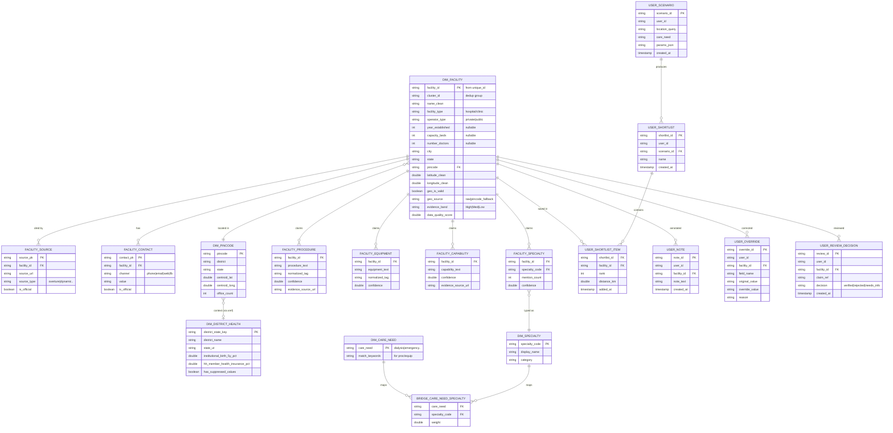

# 04 — Target Schema & ERD

Gold-layer star schema for the Referral Copilot, plus user-persistence tables.

## Table groups

| Group | Tables |
|---|---|
| **Reference / dimension** | `dim_pincode`, `dim_district_health`, `dim_specialty`, `dim_care_need`, `bridge_care_need_specialty` |
| **Core** | `dim_facility`, `facility_source` (citations), `facility_contact` |
| **Evidence (claims to verify)** | `facility_specialty`, `facility_procedure`, `facility_equipment`, `facility_capability` |
| **User persistence** | `user_scenario`, `user_shortlist`, `user_shortlist_item`, `user_note`, `user_override`, `user_review_decision` |

## Mermaid ERD

## Why this fits the Referral Copilot

- **Location + need in → ranked out** — `DIM_CARE_NEED → DIM_SPECIALTY → FACILITY_SPECIALTY`, ranked by distance from validated `latitude_clean` / `longitude_clean` (pincode fallback when raw coords fail the India bounding box).
- **Evidence attached** — each candidate joins `FACILITY_*` claim rows + `FACILITY_SOURCE` URLs for citation of every important claim.
- **Honest uncertainty** — per-claim `confidence`, facility `evidence_band`, `geo_is_valid`, and `state_mismatch` surface weak/suspicious evidence instead of hiding it.
- **Persistence** — `USER_SCENARIO / SHORTLIST / NOTE / OVERRIDE / REVIEW_DECISION` cover save, revise, and review-decision workflows.
